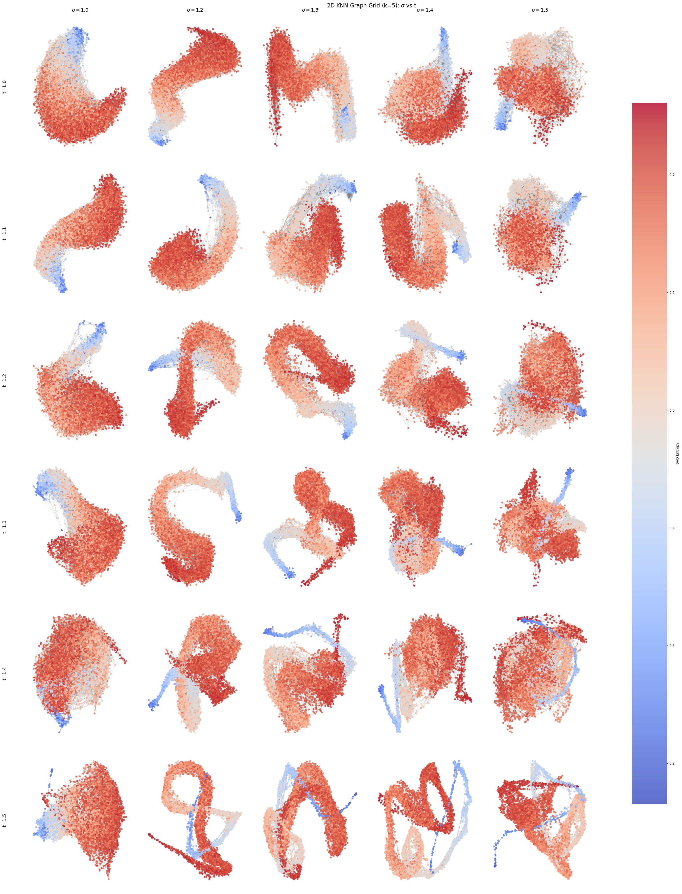

# Knowledge Discovery in Text Corpora with DiffusionMaps and Information Theory

## Modeling Human Learning as Paths Along Entropy Gradients in Scientific Text Corpora

### Abstract for Entropy 2026 Conference

The evolution of scientific language reflects the dynamic nature of human knowledge acquisition, with new concepts emerging at the research frontier characterized by low-probability word combinations carrying high information content. While machine learning frames learning as entropy reduction, human knowledge integration fundamentally involves navigating from general, low-entropy foundational concepts toward specialized, high-entropy advanced material. This work presents a novel information-theoretic framework that models human learning as directed paths along entropy gradients in document spaces, characterized through asymmetric cross-entropy relationships.

We leverage Latent Semantic Analysis (SVD of TF-IDF matrices) to extract latent conceptual dimensions and introduce an entropy-based complexity measure computed on non-negative SVD components. This measure captures document position on a generality-specialization spectrum, characterizing the distribution of information across latent semantic features. Going beyond symmetric similarity metrics, we employ cross-entropy as a directed document similarity measure, interpreting the asymmetry through the lens of encoding one document's content using another's probability distribution—a natural analogue to the directional nature of knowledge prerequisites and concept dependencies.

Analysis of OpenWebMath and Wikipedia corpora reveals strong empirical connections between our SVD-based entropy measure and established linguistic complexity indicators including word rank distributions and cross-entropy relative to corpus-wide word frequencies. High-entropy documents exhibit specialized, narrow terminology distributions, while low-entropy documents employ more general, foundational vocabularies. The asymmetric cross-entropy kernel naturally encodes which documents serve as conceptual prerequisites for others, enabling the construction of entropy-guided learning trajectories that progress from foundational to advanced material.

This framework provides a principled information-theoretic approach to modeling human learning paths, curriculum design, and understanding knowledge organization in scientific discourse. By modeling learning as navigation along entropy gradients—from broadly accessible, low-complexity texts toward specialized, high-complexity material—we bridge concepts from information theory, human cognition, and computational linguistics to offer new perspectives on how learners traverse the landscape of scientific knowledge.

**Keywords:** information theory, cross-entropy, document complexity, entropy measures, latent semantic analysis, knowledge structure

